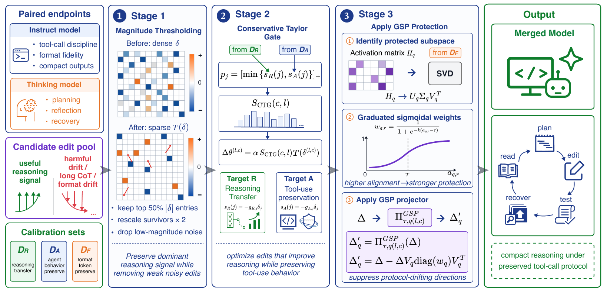

# CRANE — Constrained Reasoning Injection for Code Agents via Nullspace Editing

Reproduction code for the NeurIPS 2026 submission. Implements the CRANE
merge pipeline (Stage 1 magnitude thresholding `Φ(δ)`, Stage 2
Pareto-gated Taylor block importance `S_reason(c, l)`, Stage 3
Graduated Sigmoidal Projection `Π_τ`), six baseline merges
(Task-Arithmetic / TIES / SLERP / AIM-TA / AIM-TIES / LEWIS / RAIN),
and the three benchmark harnesses cited in the paper (Roo-Eval,
SWE-bench-Verified, Terminal-Bench v2).



## Hardware

The paper's main runs use **1× node with 4× H100 80GB**. CRANE merge
itself fits in this budget; SWE-bench-Verified and Terminal-Bench v2
also fit because they run vLLM with TP=4 + expert parallel. Roo-Eval is
single-GPU per concurrent worker.

Disk: ≈300 GB for the four base checkpoints + per-merge outputs;
≈600 GB for the prebuilt SWE-bench eval images; the Daytona side of
Terminal-Bench v2 is cloud-hosted.

## Repo layout

```
.
├── env.sh                 # top-level env (CRANE_REPO_ROOT, CRANE_DATA_DIR, …)
├── crane/                 # CRANE method internals (gsp_projector, calibration, …)
├── src/                 # CRANE main pipeline (entry points, paper §3)
├── baseline/              # 6 baseline merges (paper Tables 1–3)
├── roo_test/              # Roo-Eval harness (paper §4.1)
├── swe_bench/             # SWE-bench-Verified harness (paper §4.2)
├── terminal_bench/        # Terminal-Bench v2 harness (paper §4.3)
└── checkpoints/           # placeholder; download from Google Drive
```

`src/_common.py` adds `../crane/` to `sys.path`, so `src/` and
`crane/` must remain siblings. The benchmark harness directories are
independent; you can install only the venv(s) you need.

## Setup

### 1. Clone and configure

```bash
git clone <this-repo-url> code_repo
cd code_repo

# Adjust as needed; defaults in env.sh assume the repo is the project root.
export CRANE_REPO_ROOT="$(pwd)"
export MZ_CACHE="$HOME/.cache/crane"     # pip / uv / triton / torch caches
# (Optional) CUDA toolkit, Node, Rust, Go for Roo-Eval — see env.sh
source env.sh
```

### 2. Install Python deps

```bash
# (a) Merge-time venv (also used to serve vLLM). Python 3.11 recommended.
python3.11 -m venv "$CRANE_REPO_ROOT/.venv"
source "$CRANE_REPO_ROOT/.venv/bin/activate"
pip install -r requirements.txt -r requirements-eval.txt
deactivate

# (b) OpenHands + swebench venv (Python 3.12). See swe_bench/UPSTREAM.md
# for the full pip install line. Apply the rootless-podman patch:
python3.12 -m venv "$CRANE_REPO_ROOT/.venv-openhands"
source "$CRANE_REPO_ROOT/.venv-openhands/bin/activate"
# (full install command in swe_bench/UPSTREAM.md)
python -m swe_bench.swebench_lchown_patch
deactivate
```

### 3. Clone upstream dependencies

Each subdirectory's `UPSTREAM.md` lists the repo URL + tested commit:

- [`roo_test/UPSTREAM.md`](roo_test/UPSTREAM.md) — Roo-Code + Roo-Code-Evals
- [`terminal_bench/UPSTREAM.md`](terminal_bench/UPSTREAM.md) — laude-institute/terminal-bench
- [`swe_bench/UPSTREAM.md`](swe_bench/UPSTREAM.md) — OpenHands SDK (+ optional SWE-agent / moatless / openhands-benchmarks)
- [`baseline/RAIN_UPSTREAM.md`](baseline/RAIN_UPSTREAM.md) — RAIN-Merging

### 4. Download checkpoints

See [`checkpoints/README.md`](checkpoints/README.md). The four base
Qwen3 checkpoints + the pre-computed Taylor / GSP artifacts live on a
Google Drive share. After download, point `CRANE_CHECKPOINT_DIR` and
`CRANE_DATA_DIR` at the unpacked directory.

You can also recompute everything from scratch — see "Reproduce CRANE"
below.

## Reproduce CRANE

```bash
source env.sh

# Stage 2: Pareto-gated Taylor importance (S_reason).
# 30B: ≈6 min on 4× H100. 80B-Next: ≈32 min via FSDP.
python src/crane_s_reason_auto.py \
    --model-preset qwen3-30b \
    --output "$CRANE_DATA_DIR/phase2_stats_30b.json"

# Or for 80B-Next (FSDP):
torchrun --nproc_per_node=4 src/crane_s_reason_auto_fsdp.py \
    --model-preset qwen3-next-80b \
    --output "$CRANE_DATA_DIR/phase2_stats_80b_next.json"

# Stage 3: Graduated Sigmoidal Projection (Π_τ format projectors).
# 30B: ≈3 min. 80B-Next: ≈18 min.
python src/crane_gsp.py --model-preset qwen3-30b
# (For Qwen3-Next, also compute the linear-attention inner projector.)

# Final merge: θ_M = θ_I + Π_τ(α · S_reason · Φ(δ)).
# 30B: <10 min. 80B-Next: <25 min.
python src/crane_merge.py \
    --model-preset qwen3-30b \
    --stats "$CRANE_DATA_DIR/phase2_stats_30b.json" \
    --gsp   "$CRANE_DATA_DIR/format_projectors_30b.pt" \
    --out   "$CRANE_MERGED_DIR/crane_30b" \
    --alpha 0.25 --tau 0.03
```

The detailed pipeline (boundary tensors, MoE handling, FSDP gotchas) is
in [`src/README.md`](src/README.md).

## Reproduce baselines

```bash
source env.sh
cd baseline
# 4B (smoke test; not in paper):
bash run_4b_merge_parallel.sh

# 80B-Next (used in Tables 1–3):
bash run_80b_merge_parallel.sh
# Produces baseline_model/qwen3_next_80b/{task_arithmetic,ties,slerp,aim_ta,aim_ties,lewis}/.
```

The same scripts at α=0.30 / 30B settings are documented inline. RAIN is
run separately via `roo_test/sh/run_rain*.sh`. Selected hyperparameters
are listed in Appendix Table 7 of the paper.

## Reproduce Table 1 (Roo-Eval)

```bash
source env.sh
cd roo_test

# Sanity-check single language × single model:
bash sh/eval_one/<language>.sh <yaml-config>

# Full sweep (all 5 languages × 3 rollouts × 195 exercises = 585 rollouts):
sbatch sh/run_all_languages_3_b.sh   # 80B-Next sweep
sbatch sh/run_all_languages_3_c.sh   # 30B sweep

# Component-removal ablations (Table 4):
sbatch sh/run_80b_ablations.sh

# RAIN baseline rows:
sbatch sh/run_rain.sh
```

Per-language results land in
`${CRANE_LOG_DIR}/eval-results/<model>/<language>/`. Aggregate with the
existing `roo_test/sh/eval_one/aggregate.sh` once a sweep finishes.

## Reproduce Table 2 (SWE-bench-Verified)

```bash
source env.sh
cd swe_bench

# One-time: prebuild eval-image wrappers (≈90 min on 1 node).
bash prebuild_wrappers.sh

# Full 500-instance sweep:
sbatch run_swebench_30b.sh
sbatch run_swebench_80b.sh

# Component-removal ablations (Table 5 right half):
sbatch run_swebench_30b_ablation.sh
sbatch run_swebench_80b_ablation.sh

# RAIN baseline:
sbatch run_swebench_rain.sh
```

The OpenHands SDK adapter (`openhands_swebench.py`) shells out to per-instance
podman containers; see `harness_fast.py` for the docker-py timeout +
list-images patches the harness needs to survive a 500-instance run.

## Reproduce Table 3 (Terminal-Bench v2)

```bash
source env.sh
cd terminal_bench

# Set Daytona credentials and your GHCR namespace:
export DAYTONA_API_KEY=...
export GHCR_USER=...        # your github user/org

# 89-task sweep, k=5 attempts/task, longest-first schedule:
bash tb2/sh/run_tb2_30b.sh
bash tb2/sh/run_tb2_80b.sh

# Component-removal ablations (Table 5 left half):
bash tb2/sh/run_tb2_30b_ablation.sh
bash tb2/sh/run_tb2_80b_ablation.sh
```

Results aggregate via `tb2/aggregate.py` (per-method LLM/Daytona dollar
split + per-task solve counts).

## Citation

If you use this code, please cite the paper. 
```bibtex
@misc{zhu2026crane,
  title        = {CRANE: Constrained Reasoning Injection for Code Agents via Nullspace Editing},
  author       = {Zhu, Mingzhi and Merler, Michele and Pavuluri, Raju and Patterson, Stacy},
  year         = {2026},
  eprint       = {2605.14084},
  archivePrefix= {arXiv},
  primaryClass = {cs.SE},
  url          = {https://arxiv.org/abs/2605.14084}
}
```
## License

Apache 2.0 (see `LICENSE`). Upstream dependencies retain their own
licenses; see each `UPSTREAM.md` for links.
